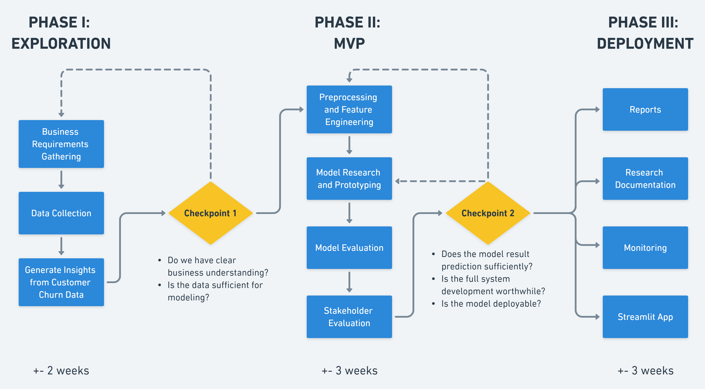

# Blockchurn

## Background

The phenomenon of customer attrition, known as 'churn', has a deleterious effect on a company's income. As the industry grows with innovative offerings, the rivalry becomes more demanding and causes customer acquisition to be more complicated. Acquisition costs and retention costs are promotional outlays that are necessary to maintain a steady customer base. According to outboundengine.com, the cost of acquiring a new customer is five times greater than retaining an existing one, and increasing customer retention by just 5% can increase profits anywhere from 25% to 95%. Hence, it is more beneficial to tackle churn than to acquire new customers.

This issue is widespread across many industries, including the Telecom sector. In the long run, a high rate of turnover can be highly detrimental to a business, thus it is essential to identify those customers who are at risk of churning. However, due to the inefficacy of human capability in processing and predicting large datasets, machine learning is an invaluable tool to predict churn. By applying machine learning to predict churn, the company can allocate costs better and take proactive steps to retain customers - such as targeted communication, soliciting feedback, or offering discounts and bundling campaigns - in order to reduce churn rates.

## Goal

Build machine learning models to predict customers who are likely to churn.

## Dataset

Dataset: Telecom Customer Churn

Description: The Customer Churn table contains information on all 7,043 customers from a Telecommunications company in California in Q2 2022

Source: [here](https://www.kaggle.com/datasets/shilongzhuang/telecom-customer-churn-by-maven-analytics?select=telecom_customer_churn.csv)

## Project Approach

### Roadmap



### ML Development Steps

#### 1. Data Preparation

**Goals**: Understand the data and prepare the data for the next steps

**Definition of done**: data_preparation.py run properly, splitted dataset (train, valid, test) are created

**What have been done here**: variables type checking, missing data checking, data range checking, remove unnecessary features and rows, change some values, handling missing value to ensure the data can be splitted, data splitting

#### 2. Exploratory Data Analysis for ML

**Goals**: Determine preprocessing and feature engineering strategies

**Definition of done**: eda.ipynb run properly

**What have been done**: variables type checking, missing data checking, data range checking, skewed data checking, data distribution, correlation, t-test, imbalance label checking, outliers checking

#### 3. Preprocessing and Feature Engineering

**Goals**: Prepare data to create the features that are expected by the ML model

**Definition of done**: preprocess.py run properly, the preprocessed data are created

**What have been done here**: handling missing values, drop unnecessary features, remove outliers, one hot encoding, balancing label, label encoding, dump preprocessed data to defined path

### 4. Modeling

**Goals**: Get the best model for production

**Definition of done**: modeling.py run properly, the chosen model is at least 5% better than baseline model, blockhurn_v1.pkl is created

**What have been done here**: train and evaluate vanilla mode, choose best vanilla model for production, try optimize with hyperparameters tuning, choose best model for production model

## Output

### 1. API

The API contains /predict_single endpoint. How to run: `src/api.py`

Go to localhost:8080/docs to see detailed documentation. The required input example:

```
{
  "gender": "Female",
  "age": 19,
  "married": "Y",
  "number_of_dependents": 0,
  "number_of_referrals": 0,
  "tenure_in_months": 1,
  "offer": "None",
  "phone_service": "Y",
  "avg_monthly_long_distance_charges": 5,
  "multiple_lines": "Y",
  "internet_service": "Y",
  "internet_type": "Cable",
  "avg_monthly_gb_download": 10,
  "online_security": "Y",
  "online_backup": "N",
  "device_protection_plan": "Y",
  "premium_tech_support": "Y",
  "streaming_tv": "N",
  "streaming_movies": "Y",
  "streaming_music": "Y",
  "unlimited_data": "Y",
  "contract": "One Year",
  "paperless_billing": "N",
  "payment_method": "Credit Card",
  "monthly_charge": 100,
  "total_charges": 50,
  "total_long_distance_charges": 0,
  "total_revenue": 10500
}
```

**Success Response**

```
{
  "res": "Churned",
  "error_msg": ""
}
```

### 2. Streamlit App

How to run: `src/streamlit_app.py`


## References

[An exact analytical relation among recall, precision, and classification accuracy in information retrieval](http://www.cs.bc.edu/~alvarez/APR/aprformula.pdf)

[ML Process Demo](https://github.com/cbagusjk/ml_process_demo)

[How to clean up column headers in Pandas](https://github.com/Sven-Bo/clean-up-column-headers-in-pandas)

[Preprocessing data for ML](https://cloud.google.com/architecture/data-preprocessing-for-ml-with-tf-transform-pt1#:~:text=Preprocessing%20the%20data%20for%20ML,expected%20by%20the%20ML%20model.)

[Vertical vs Horizontal Slicing Data Science Deliverables](https://www.datascience-pm.com/vertical-vs-horizontal-slicing-data-science-deliverables/)

[Data Science Roadmap](https://www.datascience-pm.com/example-roadmap/)

[Customer Retention Marketing vs. Customer Acquisition Marketing](https://www.outboundengine.com/blog/customer-retention-marketing-vs-customer-acquisition-marketing/)
